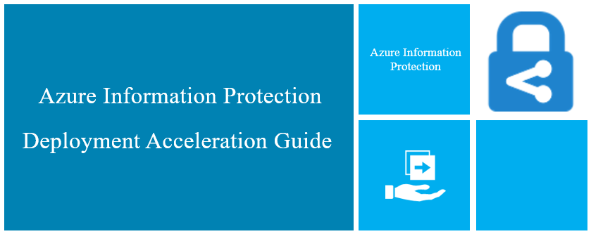
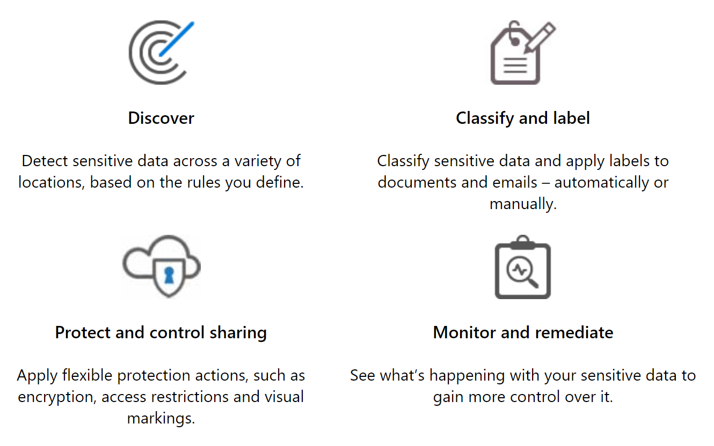
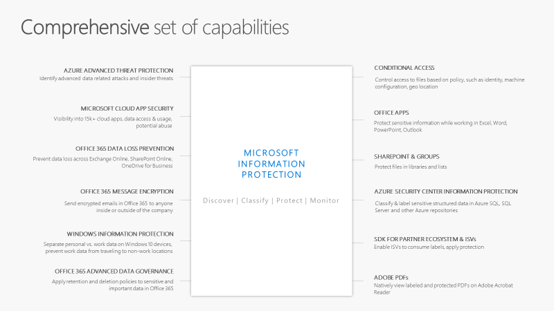
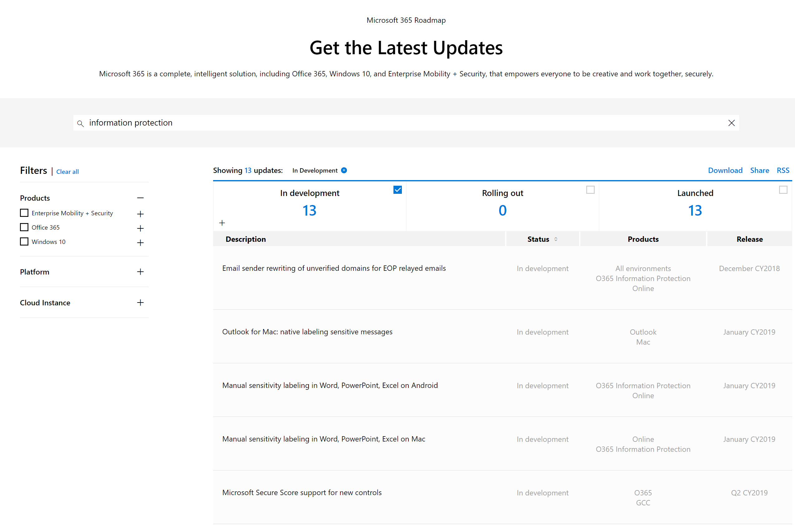
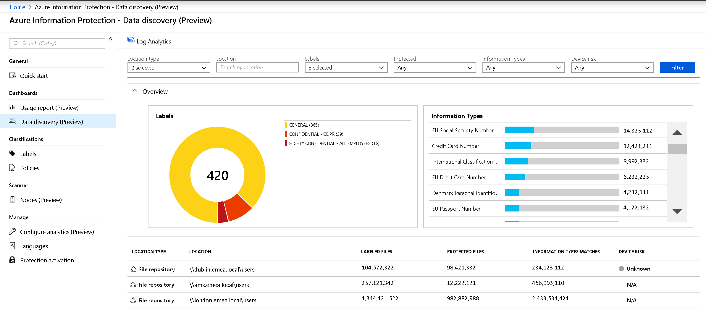
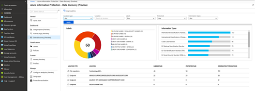
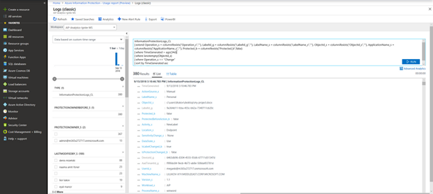
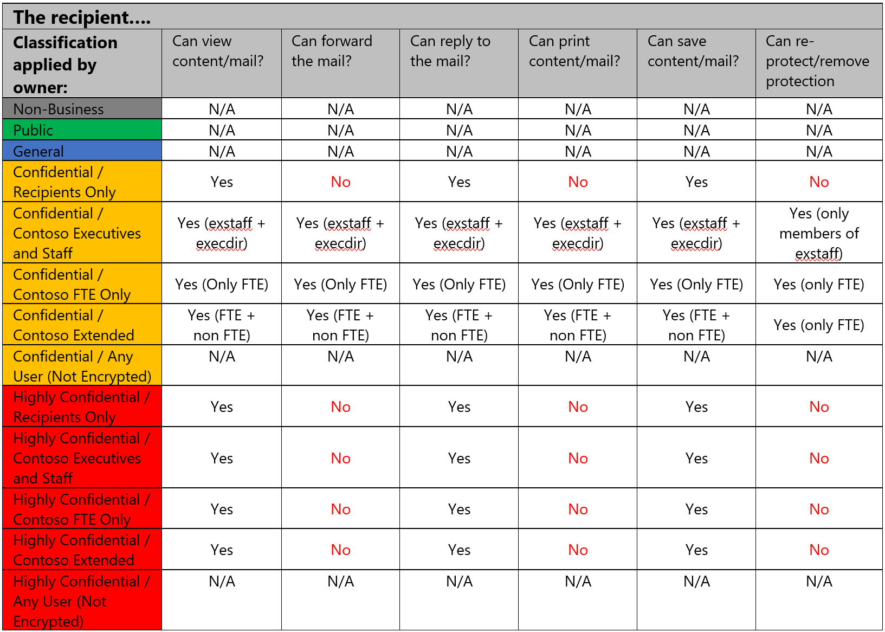

 

---

> MICROSOFT MAKES NO WARRANTIES, EXPRESS OR IMPLIED, IN THIS DOCUMENT. 
>
> Complying with all applicable copyright laws is the responsibility of the user. Without limiting the rights under copyright, no part of this document may be reproduced, stored in or introduced into a retrieval system, or transmitted in any form or by any means (electronic, mechanical, photocopying, recording, or otherwise), or for any purpose, without the express written permission of Microsoft Corporation. 
> Microsoft may have patents, patent applications, trademarks, copyrights, or other intellectual property rights covering subject matter in this document. Except as expressly provided in any written license agreement from Microsoft, our provision of this document does not give you any license to these patents, trademarks, copyrights, or other intellectual property. 
>
> The descriptions of other companies’ products in this document, if any, are provided only as a convenience to you. Any such references should not be considered an endorsement or support by Microsoft. Microsoft cannot guarantee their accuracy, and the products may change over time. Also, the descriptions are intended as brief highlights to aid understanding, rather than as thorough coverage. For authoritative descriptions of these products, please consult their respective manufacturers.
>
> © 2019 Microsoft Corporation. All rights reserved. Any use or distribution of these materials without express authorization of Microsoft Corp. is strictly prohibited. Microsoft and Windows are either registered trademarks or trademarks of Microsoft Corporation in the United States and/or other countries. 
>
> The names of actual companies and products mentioned herein may be the trademarks of their respective owners.

---
[TOC]
# Azure Information Protection - Deployment Acceleration Guide

## Overview

Azure Information Protection (AIP) is a cloud-based solution that can help organizations to protect sensitive information by classifying and (optionally) encrypting documents and emails on Windows, Mac, and Mobile devices. This is done using an organization defined classification taxonomy made up of labels and sub-labels.  These labels may be applied manually by users, or automatically by administrators via defined rules and conditions.  Additionally, recommendations may be provided to guide users in making appropriate labeling decisions.

The Azure Information Protection Get to Production (GTP) team is part of the Azure Security Engineering Division at Microsoft. Our team in comprised of subject matter experts who work closely with select customers (usually based on size and/or complexity) to help them realize the value of their investment by providing guidance for **successful** **and** **rapid deployments**. 

This document is intended for Information Security, IT Security, and Compliance managers interested in understanding our recommendations for approaching an Information Protection project. While there will be some technical discussion throughout various sections of this document, we have found that the most challenging part of an AIP deployment is the business process and decisions that must be made. To that end, this document will focus less on how to technically implement AIP and more on a discussion of why you are doing each step. The technical details have documented in various locations, so we have provided
links to these throughout the document and aggregated them in the [appendix](#appendix--additional-resources).

To successfully implement AIP as a solution, we recommended following the phases of the Microsoft Information Protection Lifecycle as shown below:

The lifecycle of a specific document will be comprised of the following phases: Discover, Classify, Protect, and Monitor. During each of these steps, the document will become incrementally better managed and more secure. 

Interestingly, a deployment of this technology will also follow these four phases, since experience shows it is best to introduce each of these capabilities in orderly succession. At each step, your information becomes better managed and more secure, and you don't need to wait until you are ready to go all the way to begin realizing value from your investments.

In this document, we will review each of these phases and provide best practices and lessons learned from deployments that we, the AIP GTP team, have assisted with across many different companies and industries. 

---

## The Microsoft Information Protection Story

Azure Information Protection (as described above) is one part of the larger [Microsoft Information Protection](https://www.microsoft.com/en-us/security/technology/information-protection) story.  With Microsoft Information Protection, Microsoft is streamlining how all applications that require information protection capabilities interact.  This provides a unified interface where both Microsoft and Partner applications can classify and protect sensitive information. Ultimately, this mean better integration across our information protection solutions and a more consistent approach to protecting your sensitive data.

The image below shows technologies that currently interface with Microsoft Information Protection. Although we will not delve deeply into all these technologies in this document, we will provide resources in the [appendix](#appendix--additional-resources) that may be used for further exposition.  

### Microsoft Information Protection SDK

The [Microsoft Information Protection (MIP) SDK](https://docs.microsoft.com/en-us/information-protection/develop/overview) uses Sensitivity Labels from the Security and Compliance Center, so any integrations based on the MIP SDK will display labels from this source.  Activation (migration) of sensitivity labels to the Security and Compliance Center is currently in Public Preview and this process is in our [documentation](https://docs.microsoft.com/en-us/azure/information-protection/configure-policy-migrate-labels). We recommend starting with creation of labels in the Azure Portal and Activating them when this process is in General Availability.  

### Microsoft 365 Information Protection Roadmap

The [Microsoft 365 Roadmap website](https://www.microsoft.com/en-us/microsoft-365/roadmap) has public details about when new features are in development and when they have been launched. To see details around new AIP features in development, rolling out, and launched, search for [Information Protection](https://www.microsoft.com/en-us/microsoft-365/roadmap?filters=&searchterms=information%2Cprotection) and check the boxes to select which details you are interested in.

---

## Getting Started

Before jumping into the various sections detailing the stages of AIP deployment, there are some planning and prerequisite items that should be addressed.  These include general prerequisites, scheduling and recommended attendance of meetings, and support and communication planning.  In this section, we will touch on these items and provide some general guidance based on what we have seen help customers be successful in deployments of AIP.

While these tips are meant to help guide you on your AIP deployment journey, please keep in mind that these items will vary widely depending on the size and complexity of your organization. 

### General Requirements

The full list of AIP requirements can be found on our [official documentation site](https://docs.microsoft.com/en-us/azure/information-protection/requirements).  We have summarized some of the more important ones that are required for all deployments of AIP. If you have complex security rules or require offline client access, we highly advise reading the full documentation before deploying.

**Licensing Requirements**

In this document, we will describe features of Azure Information Protection that are only available through an [Azure Information Protection Plan](https://azure.microsoft.com/en-us/pricing/details/information-protection/). This is most commonly bundled with Enterprise Mobility and Security, Microsoft 365, or Identity and Information Protection licensing SKUs, but AIP can also be purchased as standalone licenses. [Office 365 plans](https://download.microsoft.com/download/E/C/F/ECF42E71-4EC0-48FF-AA00-577AC14D5B5C/Azure_Information_Protection_licensing_datasheet_EN-US.pdf) include AIP for protection only, but this document will assume an AIP licensing plan that covers the full feature set.

**Azure Active Directory**

Your organization must have an Azure Active Directory (Azure AD) to support user authentication and authorization for Azure Information Protection. Configuring Single Sign-On (SSO) for Azure AD is also highly recommended for a seamless user experience.  Additional details on requirements for Azure AD can be found in [our documentation](https://docs.microsoft.com/en-us/azure/information-protection/requirements-azure-ad).

**Network Connectivity**

A common stumbling block for many AIP deployments are the [Firewall and Network Requirements](https://docs.microsoft.com/en-us/azure/information-protection/requirements#firewalls-and-network-infrastructure).  Azure Information Protection uses a subset of the [Office 365 URLs and IP address ranges](https://docs.microsoft.com/en-us/office365/enterprise/urls-and-ip-address-ranges).  We recommend following the guidance in the Office 365 documentation and opening all **Required** URLs and IP addresses listed under the [Microsoft 365 Common and Office Online](https://docs.microsoft.com/en-us/office365/enterprise/urls-and-ip-address-ranges#microsoft-365-common-and-office-online) section. Additionally, if using Office 2010 there is an optional URL required.

One additional callout is that termination of TLS client-to-service connections (for example, to do packet-level inspection) to the aadrm.com URL will break certificate pinning required by AIP to ensure secure communications with the Microsoft Root Certificate Authority.

### Project Planning

Project planning is an art unto itself and when done well it can set you up for an efficient deployment experience.  Although we will not delve into the full project planning that goes into deploying AIP, below are some initial meetings that we typically have with our customers and stakeholders that we recommend attend those meetings.

**Kick Off Meeting**

This can be a single long meeting, or a series of more targeted meetings followed by a combined discussion that will help to define a common vision for what the organization needs from AIP and how best to achieve that goal. Common attendees for these meetings are the CISO, Cloud Architect, Project Manager, Business Unit Decision Makers, and Technical Teams.

Some of the items that are commonly discussed at this meeting or meetings are:

- Identification of Executive Sponsor and Project Manager
- Development of Business Scenarios and Use Cases
- Decisions around high level Taxonomy (to use existing classifications or start fresh)

**Milestones and Success Criteria Meeting**

This meeting will be to discuss the major milestones that will ensure that the project is moving at an acceptable pace and define the success criteria for the entire deployment.  This meeting should take place before production rollout begins but may be held after production POC and feedback cycles to help with defining realistic timeframes for deployment. Common attendees for these meetings include CISO or representative, Project Manager, Technical Teams, Support and Continuous Engineering Teams.

Some of the items that are commonly discussed at this meeting are:

- Deployment timelines and Milestones
- Rollout Plan
- End-user Education
- Technical Support Requirements

---

## Discover

Implementing an Information Protection solution should not be a one-time event, but rather a journey with many steps along the way.  That said, it is important to simplify this journey and address implementation and rollout using a phased approach.

The first phase which every company can and should do to accelerate the deployment discussion and have more visibility into their data is the Discover phase.

The Discover phase will provide information into the kind of data that resides in different repositories within your organization.  AIP can identify and visualize sensitive information within documents, which can help to drive appropriate levels of attention and urgency behind deployment of information protection technologies. 

Before we can begin discussing the right methods for performing discovery, we must understand where data is stored within an organization.  Microsoft and our deployment partners have identified four primary scenarios that describe the location of customer data.

1. On-Premises Data Only – The organization has not yet begun migrating (or has migrated very little) data to the cloud.
2. Beginning Data Migration – The organization has begun migrating data, but most of the data is still residing on-premises.
3. Hybrid Data Management – The organization has moved a large amount of data to the cloud but retains some data on-premises.
4. Full Cloud Data Management – The organization has moved all important data to the cloud and has mandated cloud storage to be the primary data repository for new data. 

Now that we have discussed where data may be stored, we can talk about the supported options for discovery for these organizations.  

- For organizations that have not yet moved their data to the cloud (organizations that fall under #1 above), we recommend deploying the [AIP Scanner](https://docs.microsoft.com/en-us/azure/information-protection/deploy-aip-scanner) to do discovery against their on-premises repositories (CIFS/SMB file shares and SharePoint libraries). 
- For organizations doing full cloud data management (#4 above), we recommend using [Microsoft Cloud Application Security](https://docs.microsoft.com/en-us/cloud-app-security/what-is-cloud-app-security) (MCAS) and [Office 365 DLP](https://docs.microsoft.com/en-us/office365/securitycompliance/data-loss-prevention-policies) capabilities to do discovery of sensitive information residing in various web repositories.
- For organizations that have data in both locations (#2 & 3 above), a combination of both methods will be necessary to perform comprehensive discovery of sensitive information.  This represents most of the organizations we typically work with.

The rest of this section will cover the capabilities of the AIP scanner and a brief overview of MCAS and Office 365 DLP capabilities.

### Azure Information Protection Scanner 

One of the most daunting tasks facing organizations today is the large amount of architectural debt they have accrued over decades of operation.  This includes a vast amount of data in on-premises repositories around the world that is unclassified and often improperly secured. Gaining visibility into this data is a challenge that every organization must face.

The Azure Information Protection scanner is the solution that Microsoft uses internally for this challenge and recommends to our customers. The AIP scanner runs as a service on Windows Server and is efficient for bulk operations on data stores like CIFS/SMB file shares and SharePoint On-Premises libraries. Using the AIP scanner, you can generate a report listing all the scanned files and any sensitive information types discovered in those documents.

Note: The AIP scanner does not change the last modified date or any content within documents when running Discovery.

The AIP scanner uses the same content matching engine that Office DLP uses, and comes with more than [80 out-of-the-box information types](https://docs.microsoft.com/en-us/office365/securitycompliance/what-the-sensitive-information-types-look-for) which the AIP scanner will match against with no specific configuration from the customer side. This means that the AIP scanner can be used for discovery even before defining a classification taxonomy.

[Setting up the AIP Scanner in Discovery mode](https://techcommunity.microsoft.com/t5/Azure-Information-Protection/Cataloging-your-Sensitive-Data-with-AIP-Even-Before-Configuring/ba-p/267241) using the built-in information types is a fairly simple process, but we always recommend testing on non-production repositories before deploying to production. The AIP scanner can also do matching by using custom Regex patterns or plain text phrases. 

After you have configured and run the AIP scanner in discovery mode you can review the Data discovery dashboard which allows you can drill down in specific repositories to the file level. In the image below, some files had been manually labeled as seen on the left but millions of files with sensitive information were located as seen on the right.  If you have not implemented AIP in your environment, you will not see any data on the left (this is expected).

Because the AIP scanner works best when on a local network with the data it is scanning, most organizations will need multiple AIP scanner instances to cover all of their on-premises repositories.  We have the new Scanner \ Nodes section in the Azure portal that provides information on the status of multiple AIP scanner instances.

### Microsoft Cloud Application Security & Office 365 DLP

As most customers are currently in a hybrid state for their data management, it is also prudent to discuss the options for discovering data with Microsoft Cloud Application Security and Office 365 DLP.  Both solutions can be used for discovery and we use a combination of these at Microsoft to secure our data.

Microsoft Cloud Application Security can be used to perform Cloud Discovery of sensitive information in the cloud by using your traffic logs to dynamically discover and analyze the cloud apps and sensitive information that your organization is using. 

For more information about getting started with MCAS, see [Deploy Microsoft Cloud App Security](https://docs.microsoft.com/en-us/cloud-app-security/getting-started-with-cloud-app-security).

For more information about integrating MCAS and AIP, see [MCAS and AIP integration](https://docs.microsoft.com/en-us/cloud-app-security/azip-integration).

Office 365 DLP is included in Office 365 E3 and E5 plans and provides the capability to discover sensitive information in Office 365 services such as Exchange Online, SharePoint Online and OneDrive for Business.

For more information on Office 365 DLP policies, please see [Overview of O365 Data Loss Prevention policies.](https://docs.microsoft.com/en-us/office365/securitycompliance/data-loss-prevention-policies)

---

## Classify & Label

Once discovery has been performed on sensitive data, the next logical step is to Classify and Label this data.  Ideally, classification and labeling will be done concurrently with discovery.  However, this requires that you have a classification taxonomy defined and rules in place to enable automatic application of those labels.

Classification is the ability to determine the confidentiality of specific sets of sensitive information. To achieve this, each organization must:

1. Create or adopt a classification taxonomy that will be easily understood by information workers across the organization.
2. Identify different sensitive information types (from the discovery phase) and document types (e.g. technical specifications, quarterly reports…), and associate each of these to a corresponding confidentiality level. This may also vary depending on the number of occurrences of the data within a specific document.

| **Information Type**                | **Confidentiality Level** |
| :---------------------------------- | ------------------------- |
| **Quarterly   Report**              | Confidential              |
| **Technical   Specification Sheet** | Highly Confidential       |
| **<10   Credit Card Numbers**       | Confidential              |
| **10+ Credit   Card Numbers**       | Highly Confidential       |
| **M&A   Proposals**                 | Highly   Confidential     |

Identification of the sensitive information that are most important for your organization is crucial to the simplification and acceleration of the implementation process. This table shows a very simple example of the type of mappings you should define for each of the identified types of sensitive information.

AIP allows the definition of a two-dimensional classification taxonomy wherein the top-level labels (parent labels) typically represent the confidentiality level of the data. Generally, the parent labels are applicable for (and visible to) all information workers in the organization. This means that you should have these labels well defined before rolling out to all production users.

If your organization already has a classification taxonomy, it is [easy to configure](https://docs.microsoft.com/en-us/azure/information-protection/configure-policy-new-label) the corresponding labels in AIP Portal. A word of warning though – just because the organization has always used specific classifications doesn’t mean they are perfect.  

Before Microsoft redefined our classification taxonomy, our standard classifications were Low Business Impact (LBI), Medium Business Impact (MBI), and High Business Impact (HBI). We held annual training to help to our users understand what types of data fell into each category, but these classifications were not intuitive. The result was low adoption of classification in general.  The classification taxonomy presented in this document is modeled after Microsoft’s new classification taxonomy.  For information on how we developed this new taxonomy, see the [MSIT Showcase video](https://aka.ms/AIPShowcase). 

When deciding on a classification taxonomy we recommend keeping the following in mind:

- The classification taxonomy should identify the confidentiality level of the information. Based on the confidentiality level you can later decide what protection measures will be applied for each labeled document.

- A recommended classification taxonomy is one that every information worker in your organization will be able to order from least restrictive to most restrictive without any doubt. 

- Some organizations, including Microsoft during our pilot, adopted an **Internal** label as part of their taxonomy. This information was not encrypted and thus could be shared with external recipients. The term **Internal** is not a confidentiality level and could cause confusion with information workers. Thus, Microsoft and many other organizations have changed this classification to be called **General**. The description stayed roughly the same, but without the expectation that the data would only be accessible by internal users.

- Although we may recommend a taxonomy that is slightly different from the current one approved by your organization, we understand that changing the approved classification taxonomy is a task that might take time and stall the project.
 In such cases you should configure the current approved classification taxonomy and collect feedback from workers after the deployment. Label names in Azure Information Protection [are easy to change](https://docs.microsoft.com/en-us/azure/information-protection/configure-policy-change-label) if required.

If your organization doesn’t currently have a classification taxonomy, Microsoft highly recommends using the labels provided by default within AIP: [Default classification taxonomy](https://docs.microsoft.com/en-us/azure/information-protection/configure-policy-default)

- **Non-Business\Personal** Non-business data which does not belong to Contoso. Data is not encrypted and cannot be tracked or revoked. Do not use Non-Business to classify any personal data which is collected by or which belongs to Contoso. Such content should be classified as either Confidential or Highly Confidential

- **Public** To be used for business data specifically prepared and approved for public consumption. Data is not Encrypted, and owners cannot track or revoke content using AIP.

- **General** To be used for business data which is NOT meant for public consumption. However, this can be shared with internal employees, business guests and external partners as needed. Data is not Encrypted, and owners cannot track or revoke content using AIP.

- **Confidential** To be used on sensitive business data which could cause business harm if over-shared. Recipients are trusted and get full delegation rights (including the ability to remove the Encryption). Data is protected using AIP and owners can track and revoke access.

- **Highly Confidential** To be used on very sensitive business data which would certainly cause business harm if over-shared. Recipients do NOT get delegation rights (or rights to modify or remove the Encryption). Data is protected using AIP and owners can track and revoke access.

Working with different companies and industries has shown us that most organizations that have a classification taxonomy defined are very similar across industries and to what Microsoft recommends. For organizations that didn’t have a classification taxonomy in place, using the default labels helped accelerate deployment of AIP.

It’s important to remember that the taxonomy should reflect the **confidentiality** of the information. In our experience, these confidentiality levels tend to be very similar across different industries.

Labeling is the ability to add persistent metadata to information. This allows organizations to identify and take conscious actions based on this metadata.

In the classification step, you identified the important information types and data types and matched them to the appropriate confidentiality levels. After mapping these to classifications, it is simple to configure AIP to apply the correct label to the information. 

AIP can apply labels in several ways:

- Default and Manual

- Recommended & Automatic

**For manual labeling**, information workers can use the [AIP client plugin bar or menu in Office applications to easily apply the appropriate labels](https://docs.microsoft.com/en-us/azure/information-protection/rms-client/client-classify).

To minimize end user friction, we also [recommend assigning a default classification level](https://docs.microsoft.com/en-us/azure/information-protection/configure-policy-settings).  This will be applied by default to all new documents and emails. The most common default classification for information workers is **General** as this covers business information they create in their day-to-day job. The General label is also (by default) an unencrypted label.  This will minimize the impact to information workers while ensuring that any new content created is classified.

During the information life cycle, information is often changed and sometimes that will impact the confidentiality level. Thus, we allow information workers to reclassify the information to either raise or lower the confidentiality level of an item. Because there is a potential for abuse of this capability, we would recommend setting the [AIP policy setting](https://docs.microsoft.com/en-us/azure/information-protection/configure-policy-settings) which requires users to provide justification when setting a lower classification label or removing a label.

**Recommended and automatic labeling** in AIP allows you to [configure a set of conditions](https://docs.microsoft.com/en-us/azure/information-protection/configure-policy-classification) or [settings](https://docs.microsoft.com/en-us/azure/information-protection/configure-policy-settings) which the AIP client or the AIP scanner will follow and execute. These sets of conditions should be configured based on the results of the Classification phase where you have mapped different sensitive information types or custom patterns and phrases to labels.

**Recommended labeling** enables the AIP client to provide guidance to information workers on how to label a document based on its content.  By using recommendations, you help the information worker make educated decisions while still allowing them to reason over the data and decide if the classification level should be different.  This allows the creator of the data to decline the recommendation if they know a more appropriate confidentiality level for the data. This also has a side benefit of making classification a regular part of the workflow and helps reduce the amount of formal training needed on an ongoing basis. This information workers’ action based Recommended labeling is being logged and can be analyzed to better understand whether the rules configured are being accepted by information workers.

Real-life implementation examples for Recommended Labeling scenarios:

- AIP client detects 5 credit card numbers in a document and recommends the user to label it as Confidential.

- AIP client detects the phrase “Contoso Highly Confidential” and recommends that the user label the document as Highly Confidential.

The following picture shows an example of Azure Information Protection in action. The administrator has configured a label with rules that detect sensitive data - in our example, this is credit card information. When a user saves a Word document containing a credit card number, they see a custom tooltip that recommends the label configured by the administrator. If the user selects “Change now” the label will be applied, and the document will be appropriately classified and labeled.

**Automated labeling** allows the administrator to define conditions that, if matched, will apply the corresponding label automatically with no user involvement beyond creation and saving the document. When content in a document matches the administrator defined conditions (this can be a standard sensitive information type or custom pattern or phrase), the document or email is automatically classified and labeled.

When configured in Enforce mode, the **AIP scanner** will use the same administrator defined conditions to crawl on-premises repositories (file servers, network shares and SharePoint libraries) and evaluate the confidentiality level of the files. This means that administrators will not have to maintain different conditions for the AIP client and scanner but rather use a common set of conditions for both. If you have already used the AIP scanner for discovery, with a simple command you can have the scanner classify and label those identified files and run continuously on those repositories.

In addition to the AIP scanner, you can configure **MCAS** with a similar policy and use MCAS to classify files automatically in different cloud repositories – [Automatically apply Azure Information Protection classification labels](https://docs.microsoft.com/en-us/cloud-app-security/use-case-information-protection).

Real-life implementation examples for Automatic labeling scenario:

- AIP scanner runs an enforcement scan and labels all documents with 5 credit card numbers or more as Confidential.
- AIP client detects the phrase “HBI” (high business impact – old MS classification taxonomy) and labels this document as Highly Confidential.
- AIP scanner runs continuously on a configured repository, detects new GDPR related content, and labels it as Confidential in less than a minute.
- An information worker composes an email message and attaches a document that was already classified. The AIP client applies a label to the email that [matches the highest classification of the attachment](https://docs.microsoft.com/en-us/azure/information-protection/configure-policy-settings).
- MCAS monitors a Box cloud repository and sets all files that have credit card numbers or were uploaded by the finance department and are shared externally, to be automatically classified and labels as Confidential.

---

## Protect

One of the main reasons for the implementation of a classification tool is to apply protection to sensitive data. The dictionary defines **protect** as the ability “to cover or shield from exposure, injury, [or] damage”. In the auspices of data protection, AIP enables you to apply protection automatically as part of the configuration of each label. This can be in the form of metadata and visual markings that allow DLP and other systems to restrict the exposure of that data, or metadata and markings plus actual encryption provided by the Azure Rights Management Service (Azure RMS) capabilities of AIP.  This encryption can prevent unauthorized access to data that could cause injury or damage to the organization.

**Note**: While classifying and labeling your data provides protection that allows you to take reactive action, Azure RMS encryption is active persistent protection. Encryption is typically not needed for all information, just the most sensitive.  For the rest of this document, when referring to protection, we are only speaking to protection with encryption.

When defining your classification taxonomy in the second phase, you have created the portion of the taxonomy that specifies the confidentiality level.

Based on our real-world deployments, most organizations encrypt the top one or two sensitivity levels. For example, if there are four classification levels: Public, General, Confidential, Highly Confidential, the most common scenario is:

- Public – not encrypted

- General – not encrypted

- Confidential – Protected with AIP encryption; with Full Control usage rights

- Highly Confidential – Protected with AIP encryption; with Reviewer usage rights 

When you set protection on files or emails by using AIP, you must configure the usage rights. In addition, when you configure labels that will trigger protection, you select the usage rights that will then be applied automatically when the label is selected by users, administrators, or configured services.

AIP groups usage rights together into permissions levels. This makes it easier to select usage rights that are typically used together. These permissions levels help to abstract a level of complexity from users, so they can choose options that are role-based rather than individual usage rights. The [main permissions levels](https://docs.microsoft.com/en-us/azure/information-protection/configure-usage-rights) are:

- Viewer – allows users to view the data and nothing else

- Reviewer - allow users to edit the data but NOT copy information out or change the protection applied 

- Co-Author - allow users to edit the data AND copy information out but NOT change the protection applied

- Co-Owner – allow users to have Full Control which also allow to copy and change\remove protection and change the AIP label

In the Protect phase, we must determine the type of protection that will be applied and who are the users that can access specific types of content. To address this need, we recommend using sub-labels to define the audience of the content and the usage rights available to that audience.

Taking the above taxonomy as an example, we can use sub-labels for the Confidential and Highly Confidential classification levels to provide enforcement for the information protection policy defined in the organization.  This approach can help an organization to encrypt data accurately by providing multiple options based on the sensitivity of the data and the intended audience.

Based on our experience deploying this solution in many different organizations, we recommend starting with a low number of sub-labels to make it easier for information workers to interact with the classification bar and prevent confusion resulting from too many options.

When defining the protection scenarios, think of what you need to prevent, not what you want to allow.  For example, “I want to prevent unauthorized users (e.g. competition, malicious outsiders) from gaining access to this information” rather than “I want to allow my internal users to view this”.  These scenarios will lead to very different policies, and the prevention method is much easier to implement effectively. 

The first threat scenario organizations usually like to address is the outside threat/accidental leakage scenario. For this purpose, they configure a sub-label that applies protection with permissions for all employees in the organization. This effectively prevents all external users from accessing the data.

After creating the above sub-label, organizations typically decide whether they should introduce more granularity and permission rights.  To provide this type of additional granularity, you can set up scoped policies that can limit who can see and classify content with a specific sub-label.

Ideally, you will want to start with as few scopes as possible to ease the implementation for information workers and later introduce more granular scoped sub-labels like:

- Specific sub-label for HR department

- Specific sub-label for Project X ([project team with external partners](https://docs.microsoft.com/en-us/azure/information-protection/secure-collaboration-documents))

- Specific sub-label for Senior Leadership 

When introducing granular sub-labels like the examples above, they are typically not meant for everyone in the organization. To address this situation, you can target sub-labels to a specific group of users.  This has the effect of allowing users to only see the sub-labels applicable to their role. This can be done by [creating Scoped Policies](https://docs.microsoft.com/en-us/azure/information-protection/configure-policy-scope).  Scoped policies allow administrators to control labels and other AIP policy settings and target them to a specific audience.

Another business scenario that we have seen at most of our customers is the ability to collaborate securely over email. Using the new capabilities of Office 365 Message Encryption v2, we can now perform secure collaboration between business entities and social identities like Outlook, Yahoo, and Gmail. For the major social identities, the recipient can authenticate natively against that provider. For any other email addresses, the user can use a one-time passcode (OTP) to validate their identity. 

The primary way of achieving this is by creating a [Recipient Only](https://docs.microsoft.com/en-us/azure/information-protection/quickstart-label-dnf-protectedemail) sub-label which applies protection (Do Not Forward) on emails and unprotected Word, PowerPoint, and Excel attachments for all the recipients in the recipients list. The recipients will have rights to Reply, Reply All, and Edit (for attachments and replies), but will not have rights to forward, print, or perform copy/paste from these messages.

One way of thinking about the process for designing protection mechanisms is to imagine rings of protection for your environment – each blue circle represents a possible sub-label.

Knowing when not to use encryption can often be just as important as knowing when to use it.  There will be times where users must share Confidential and even Highly Confidential information with outside collaborators with no encryption applied (NDA, Audit, Compliance, Regulations). Now, if you only have protected sub-labels under Confidential and Highly Confidential you have given the information worker no choice but to improperly classify the data or remove classification entirely so that it can be shared. 

This is less than ideal, so it is recommended to create another sub-label for sensitive data that is unencrypted (this is what we do at Microsoft). The main point that we stress is that the confidentiality of data does not change because it must be sent to a different audience.  As such, the parent label (which we use to identify the confidentiality) should also not change.

Ensuring that a label with the correct confidentiality level is applied is better for awareness, tracking and monitoring. Only users that have the right to change the protection of the document can reclassify the document as not encrypted.

Additionally, when you configure a label without protection, you can complement this with protection on egress based on the label applied on the item by leveraging DLP capabilities like MCAS, Exchange Transport Rules or other DLP related solutions.

Below is an example of a recommended label and sub-label taxonomy. This will be different if a user has scoped labels, but this is a simple visualization of a highly effective taxonomy.

After your content is classified (and optionally protected), you can track and control how it is used. You can analyze data flows to gain insight into your business, detect risky behaviors, and take corrective measures.  You can also track access to documents to help prevent data leakage or misuse. The next section will delve more into the monitoring capabilities of AIP.

---
## Monitor

The information protection lifecycle would not be complete without the ability to understand the state of your sensitive data. Using AIP Analytics give organizations insights into labeled and protected items across your organization. These insights consist of information protection audit events from Azure Information Protection clients, scanners, and devices running [Windows Defender ATP](https://docs.microsoft.com/en-us/windows/security/threat-protection/windows-defender-atp/information-protection-in-windows-overview) on Windows 10.  This information is then sent to a centralized location based on Azure Log Analytics service. 

Note: Although we highly recommend using Azure Log Analytics to take advantage of these new insights, this is an opt-in service requiring Azure subscription usage and is not required.

The Usage report dashboard (shown below) provides information on the volume of labeled and protected documents and emails over time, label distribution of files by label type, and the applications used when the label was applied.

The data discovery dashboard provides information on the
location of sensitive data within your organization, such as: location of
documents labelled as confidential, data containing GDPR, PCI and other highly
regulated information.

You can drill into file repositories (scanned by the Azure Information Protection scanner) to inspect where sensitive data resides, as well as what sensitive content they contain (such as financial info, PII or other information based on content inspection).

If you wish to inspect audit raw data, export the result to Excel or [PowerBI](https://docs.microsoft.com/en-us/azure/azure-monitor/platform/powerbi), or write your own custom queries, you can do so by clicking on the Log Analytics icon from the dashboard. AIP audit log data is stored in table: *InformationProtectionLogs_CL.* [Azure Monitor](https://azure.microsoft.com/en-us/blog/use-azure-monitor-to-integrate-with-siem-tools/) can also be used to export these logs to 3rd party SIEM systems.

:warning: Please keep in mind that this workspace should be secured appropriately as this becomes effectively a map to all your sensitive data.  Because of this, using a dedicated log analytics workspace is highly recommended.

## Summary

Information Protection projects are a journey that starts with a first step which everyone can start do today – Discovery.

After executing this first step, it will give the organization more context and motivation when addressing the other phases.

When implementing AIP, you will also need to train your workers and make them aware of the data and information types and their corresponding classifications. In addition to a small training on how to interact with the classification bar, we would recommend the following:

1. Create a short document explaining the new classification taxonomy and relevant information types. This document can be hosted in your organizational web portal using the [Tell me more](https://docs.microsoft.com/en-us/azure/information-protection/configure-policy-settings) button.
    See [this classification taxonomy example](#_Classification_&_Labeling) for some ideas. 
2. Create a short training video for end users on how to interact with the classification bar. Working with the AIP classification bar should be very intuitive needing nothing  more than a short video.

If you find it hard to train your information workers, it might mean that the policy you are trying to enforce is either too complex or too restrictive for your information workers to understand during the first iteration of your AIP deployment.

One of the outcomes we observed at customers who deployed AIP with a simplified policy to start with, was that they reported that the amount of support calls related to AIP were minimal and most end-user issues could be resolved with one click. During a production pilot, typically all support calls were handled by the implementation team.
It is also recommended to set internal email distribution list for AIP admins to receive issues reported by users when clicking the [Report an Issue](https://docs.microsoft.com/en-us/azure/information-protection/rms-client/client-admin-guide-customizations#add-report-an-issue-for-users) button.

Our recommendation is to implement AIP by going over the 4 phases with simplicity in mind. This will help to ensure successful implementation and end-user satisfaction and minimize the overall deployment time. This will also help with gaining and showing immediate security value.

After you begin receiving feedback that users are happy and getting used to this new capability, you can re-initiate the 4-phase approach to add more complex and advanced scenarios per your business unit needs. 

## Best Practices Recap

As mentioned in the Overview section, this document shares a set of best practices while connecting it to the recommended AIP deployment methodology we have seen working successfully.

For your convenience, this section will summarize the best practices reviewed on this document and more, splitting it to each of the Information Protected phases. In some cases, we have also provided additional technical detail about how to implement the scenarios described above.

### Discover

- Use the Azure Information Protection scanner in discovery mode for on-premises data repositories

- Use MCAS and Office 365 DLP to perform discovery on cloud-based data

### Classify & label

- If you don't already have an in-house taxonomy for classification, start with the default classification taxonomy that come with Azure Information Protection. As you learn from user feedback, you can adjust these to meet the needs of your organization.

- If you have your own taxonomy, you may use that. However, please take the following into consideration:

  - For each classification, define the confidentiality level of the information

  - Make sure information workers can easily order the classifications from the least restrictive to the most restrictive without repeated training

  - Avoid the use of an unprotected "Internal" classification – use an alternative name, such as “General” that does not imply protection

  - Don't wait for the classifications to be perfect but get going and monitor results. It's easy to change Azure Information Protection labels later if you need to refine your classifications.

- Configure the policy setting "Select the default label", and if you are using the default label names, “General” is a good choice

- Set the policy setting "Users must provide justification to set a lower classification label, remove a label, or remove protection"

- Use the Azure Information Protection scanner to automatically apply labels for files in your on-premises data stores

- Configure MCAS to apply AIP labels to sensitive data in cloud storage repositories

- Train your information workers about the classification levels and how to apply them using Azure Information Protection

### Protect

- Don’t apply protection to all documents and email but only when encryption is required per your information handling policy

- Configure protection only on the most sensitive labels

- Use sub-labels to apply protection as this defines which users can open and use the protected content, and the parent label specifies the confidentiality of the data.

- When applying protection, think of what you need to prevent, not what you want to allow. For example, “I want to prevent unauthorized users (e.g. competition, malicious outsiders) from gaining access to this information” rather than “I want to allow my internal users to view this”.

- Unless you have very strict and concrete requirements for protection already, start with “All users in my org -> Co-Owner (Full Control)”. It gives you 90% of the protection with 10% of the effort, and most leaks would be prevented by this policy. 

- If you choose not to grant full control to users, grant full control to a certain level of manager and instruct users that they can ask their manager if they need to change the policy/share a document externally that is classified for an internal audience. 

- Because simplicity in your label design is particularly important when labels apply protection, use scoped policies so that users only see the labels that are applicable to their role(s).

- Let users apply a label without encryption for confidential information rather than force them to incorrectly change the classification level.

- When you configure a confidential label without protection, complement this with protection on egress based on the label applied on the item by leveraging DLP capabilities like MCAS, Exchange Transport Rules, or other DLP solutions.

### Monitor

- Use the GA version (1.41.51.0 or above) of the Azure Information Protection client (and scanner) so that you can use Azure Information Protection analytics to monitor how your labels are being used and see what sensitive information the scanner found. 

- A high number of calls to your help desk and confusion from information workers post training could indicate that you need to simplify your labeling design.

## Appendix – Additional Resources

This section contains links to the information found throughout this document and provides additional links to advanced or peripheral technologies that interact with AIP.

### Document Links

Information Protection

<https://www.microsoft.com/en-us/security/technology/information-protection> 

Azure Information Protection Requirements

<https://docs.microsoft.com/en-us/azure/information-protection/requirements> 

Microsoft 365 Roadmap Website

<https://www.microsoft.com/en-us/microsoft-365/roadmap> 

How to migrate Azure Information Protection labels to the Office 365 Security & Compliance Center

<https://docs.microsoft.com/en-us/azure/information-protection/configure-policy-migrate-labels> 

Sensitive Information Types used by AIP scanner discovery

<https://docs.microsoft.com/en-us/office365/securitycompliance/what-the-sensitive-information-types-look-for>

Setting up the AIP scanner in Discovery mode

<https://aka.ms/ScannerBlog> 

MCAS integration with AIP

<https://docs.microsoft.com/en-us/cloud-app-security/azip-integration>

MCAS Automatically apply Azure Information Protection classification labels

<https://docs.microsoft.com/en-us/cloud-app-security/use-case-information-protection>

Office 365 DLP Policies

<https://docs.microsoft.com/en-us/office365/securitycompliance/data-loss-prevention-policies> 

Configuring labels for a custom classification taxonomy

<https://docs.microsoft.com/en-us/azure/information-protection/configure-policy-new-label>

MSIT Showcase video (how Microsoft developed our taxonomy)

<https://aka.ms/AIPShowcase>

Defining a default classification level / Setting requirement for downgrade justification

<https://docs.microsoft.com/en-us/azure/information-protection/configure-policy-settings>

Configuring conditions for recommended and automatic labeling

<https://docs.microsoft.com/en-us/azure/information-protection/configure-policy-classification>

Configuring scoped policies

<https://docs.microsoft.com/en-us/azure/information-protection/configure-policy-scope>

Integrating Azure Monitor with SEIM tools

<https://azure.microsoft.com/en-us/blog/use-azure-monitor-to-integrate-with-siem-tools/>

Windows Defender ATP and AIP integration

https://docs.microsoft.com/en-us/windows/security/threat-protection/windows-defender-atp/information-protection-in-windows-overview

 

### Additional Information

 

Azure Information Protection Yammer community

<https://aka.ms/AIPyammer> 

Microsoft Information Protection Overview

<https://www.microsoft.com/en-us/security/technology/information-protection>

Microsoft Information Protection SDK Overview

<https://docs.microsoft.com/en-us/information-protection/develop/overview>

Azure Information Protection Documentation

<https://docs.microsoft.com/en-us/azure/information-protection/what-is-information-protection> 

Azure Information Protection Blog

<https://aka.ms/AIPBlog>

German Automotive Association (VDA) example classification taxonomy whitepaper 

<https://www.vda.de/en/topics/safety-and-standards/information-security/information-security-requirements.html>

## Classification & Labeling Taxonomy in Contoso 

The document captures the classification & labeling taxonomy which has been adopted for Contoso. 

**Classification Labels & Scope in Contoso**

**Labels:** 

◻ Non-Business 

◻ Public 

◻ General 

◻ Confidential 

◻ Highly Confidential 

**Scope:** (Available only for Confidential & Highly Confidential) 

◻ Contoso Executive and Staff (visible only to the Contoso’s Senior Leadership) 

◻ Contoso FTE (visible to all Full-Time Employees (FTE)) 

◻ Contoso Extended (visible to FTE + non-FTE) 

### Impact of each label & scope 

The table captures the impact of applying a label & scope: 

◻ The first column refers to the sub/label which can be applied by you (or any end user). 

◻ The corresponding cells captures the allowed set of recipient actions 

 

Examples from the table below: 

1. By applying the "**Non-Business**" label, recipients can view, forward, print, save the content. The content is not Encrypted. 
2. By applying the "**Confidential \ Recipients Only**" label, recipients can view, reply, print & save the content. However, recipients cannot forward the content or remove Encryption. 
3. By applying the "**Confidential \ Contoso Executive and Staff**" label, only members of ExecStaff & ExecDir can view, forward, reply, print and save the content. However, only members of ExStaff can remove the Encryption - while members of ExecDir cannot. 

### Use cases for each label 

The section calls out some common use cases for using the different labels & sub-labels. 

**Non-Business -** Non-business data which does not belong to Contoso. Data is not encrypted and cannot be tracked or revoked. Do not use Non-Business to classify any personal data which is collected by or which belongs to Contoso. Such content should be classified as either Confidential or Highly Confidential. Common examples include: 

1. You are a writing an email (using your work PC) to a friend and share photos from your last vacation. 
1. You are planning a weekend getaway with your spouse and sharing the brochure over mail. 
1. You are writing a mail requesting for updated car insurance rates 

**Public -** To be used for business data specifically prepared and approved for public consumption. Data is not Encrypted and owners cannot track or revoke content using AIP. Common examples include: 

1. Responding to a customer for an in-market product query 
1. Links to publicly available blog articles, marketing videos, forum links 
1. Sharing links to externally posted job links 

**General -** To be used for business data which is **NOT** meant for public consumption. However, this can be shared with internal employees, business guests and external partners as needed. Data is not Encrypted and owners cannot track or revoke content using AIP. This is default label in Contoso and common examples include: 

1. Newsletter for the organization 
1. NEO training content or mail 
1. Sharing any non-sensitive business content 

**Confidential -** To be used on sensitive business data which could cause business harm if over-shared. Recipients (see table above) are trusted and get full delegation rights (including the ability to remove the Encryption). Data is protected using AIP and owners can track and revoke content. Common examples include: 

1. A functional spec which can be viewed only by Contoso FTEs
1. Marketing campaign development for a new product through an external ad firm 
1. A mail from Contoso 's SLT on new compliance guidance 

**Highly Confidential -**To be used on very sensitive business data which would certainly cause business harm if over-shared. Recipients (see table above) do NOT get delegation rights (or rights to modify or remove the Encryption). Data is protected using AIP and owners can track and revoke content. Common examples include: 

1. Contact your HR with a sensitive concern 
1. A mail from SLT on the upcoming quarterly performance and guidance 
1. List of potential candidates for Cxx position to the board of directors 
1. Sharing next-gen feature prep work which includes customer profile details 

### Contoso Classification Examples

**Highly Confidential Data**

Examples of data commonly classified as **Highly Confidential** include but is not limited to:

- Contoso pre-release financial results

- Data used for authenticating or validating a person’s identity; or other information that can be used to directly or indirectly “authenticate and authorize” Contoso high-value transactions

- Data under strict regulatory handling requirements (i.e. where the legal or regulatory body specifies the handling requirements for the data)

**Confidential Data**

Examples of data commonly classified as **Confidential** include but is not limited to:

- Product documentation and supporting materials

- Non-Highly Confidential data that is subject to breach notification laws (e.g., personnel number, personal contact information)

- Non-Highly Confidential Human Resources data

- Data about Contoso employees, such as title or current role 

**General Data**

Represents our daily work product used and shared throughout Contoso. Data classified as 

Examples of data commonly classified as **General** include but is not limited to:

- Commonly shared (internal) information, including operating procedures, policies and interoffice memorandums 

- Companywide announcements and information that all employees, contingent staff, and those under NDA have been approved to read

**Public Data**

Examples of data commonly classified as **Public** include but is not limited to:

- Marketing materials created for public product releases

- Published financial information

- Materials used for presentations at open conferences, seminars, and podcasts

**Non-business Data**

Examples of data commonly classified as **Non-business** include but is not limited to:

- Your      personal emails to family, friends and colleagues not related to Contoso      business activities (e.g. lunch invitation)
- Flyer      sharing children’s summer camp information (not a Contoso sponsored      event)  

Individual non-Contoso data, such as your tax filing